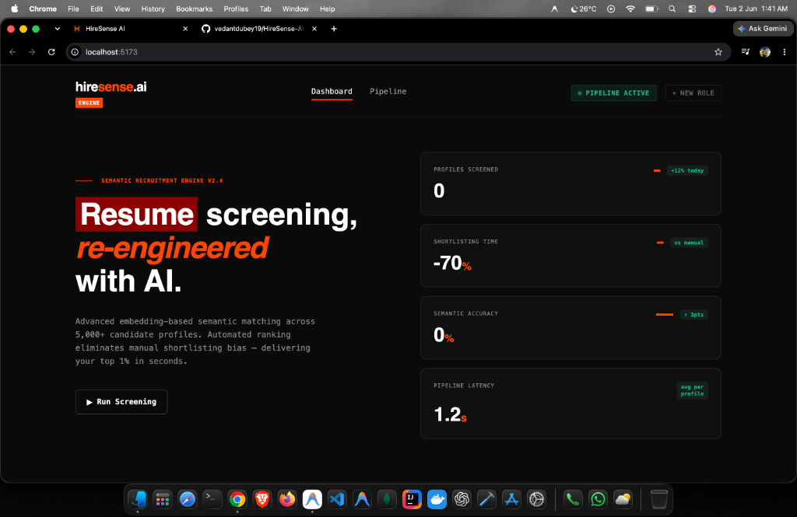
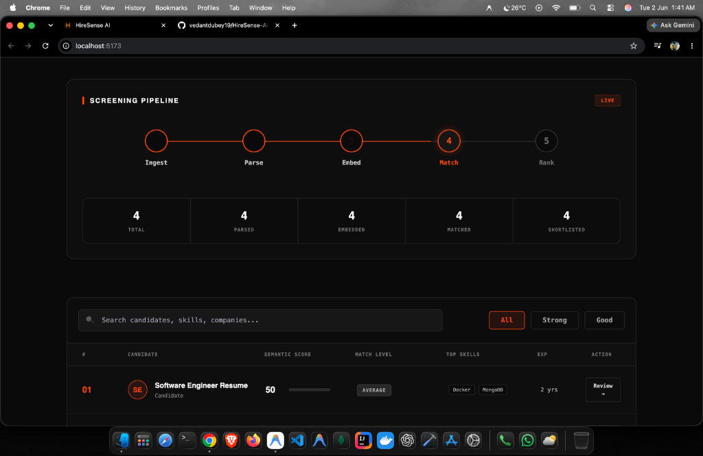
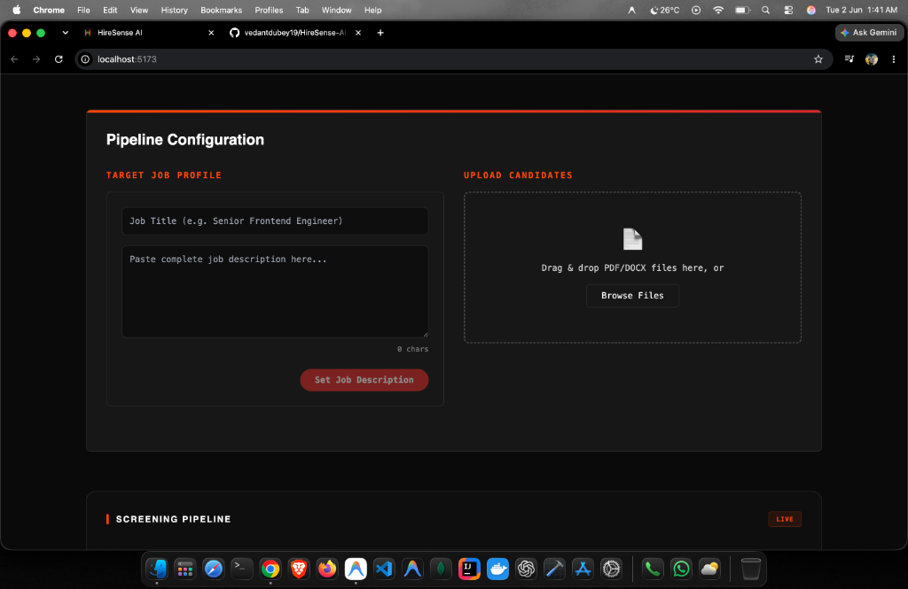
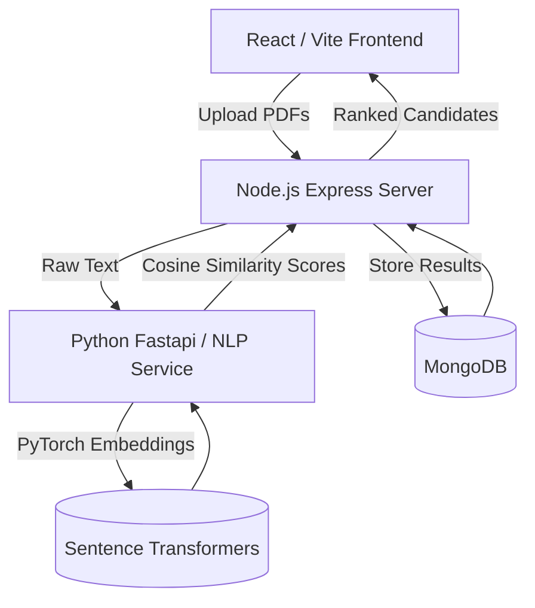

# 🧠 HireSense AI

**Created by Vedant Dubey**

> **Semantic Recruitment Engine V2.4**  
> An advanced, AI-powered applicant tracking system (ATS) that utilizes semantic vector embeddings to instantly screen, rank, and match candidate resumes against job descriptions.

## ✨ Features

- 📄 **Automated PDF Parsing:** Instantly extracts raw text and key skills from uploaded candidate resumes.
- 🧬 **Semantic Vector Matching:** Uses powerful NLP Transformers (`all-MiniLM-L6-v2` via PyTorch) to convert resumes and job descriptions into high-dimensional embeddings, ranking candidates by true semantic cosine-similarity rather than basic keyword matching.
- ⚡ **Real-Time Pipeline:** Fast API architecture that streams resumes through parsing, embedding, and matching stages in seconds.
- 🎨 **Modern Glassmorphism UI:** Built with React and Framer Motion, featuring smooth micro-animations, custom Toast notifications, and deep-dive candidate review modals.
- 📊 **Dynamic Dashboard:** Instantly visualize your recruitment pipeline, from total candidates parsed to the top 1% shortlisted.

---

## 📸 Snapshots

### 1. Dashboard & Pipeline Stepper

*Track the live progress of candidate processing through the engine.*

### 2. Job Description Configuration

*Setting the target semantic space and uploading candidate resumes.*

---

## 🏗️ Architecture



---

## 💻 Technology Stack

**Frontend:**
- React (Vite)
- TailwindCSS
- Framer Motion
- Lucide Icons

**Backend API:**
- Node.js & Express
- MongoDB & Mongoose
- Multer (In-memory file processing)

**AI / NLP Engine:**
- Python 3.11+
- FastAPI
- PyTorch
- HuggingFace SentenceTransformers (`all-MiniLM-L6-v2`)
- PyMuPDF (fitz)

---

## 🚀 Quick Setup Guide

### Prerequisites
- Node.js (v18+)
- Python (3.11+)
- MongoDB (Running locally on default port `27017`)

### 1. Start the NLP Service (AI Engine)
```bash
cd nlp-service
python -m venv venv
source venv/bin/activate  # On Windows: venv\Scripts\activate
pip install -r requirements.txt
python main.py
```
*Runs on `http://localhost:8000`*

### 2. Start the Backend API
```bash
cd server
npm install
# Ensure MongoDB is running!
npm run dev
```
*Runs on `http://localhost:5555`*

### 3. Start the Frontend Client
```bash
cd client
npm install
npm run dev
```
*Runs on `http://localhost:5173`*

---

## 🤝 Contributing
Pull requests are welcome. For major changes, please open an issue first to discuss what you would like to change.
